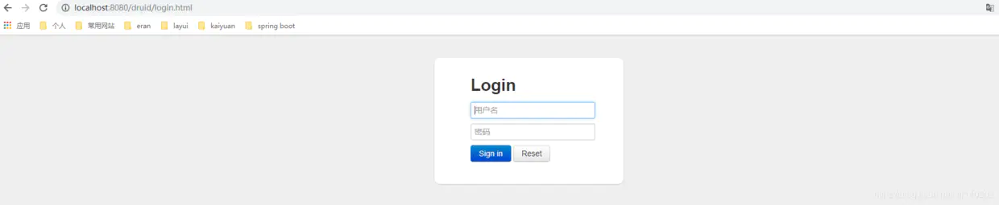

> https://blog.csdn.net/weixin_37799575/article/details/125102566


# Druid

Druid是阿里巴巴的一个开源项目，号称为监控而生的数据库连接池，在功能、性能、扩展性方面都超过其他例如DBCP、C3P0、BoneCP、Proxool、JBoss DataSource等连接池

## Spring boot集成Druid

```
<dependency>       
    <groupId>com.alibaba</groupId>       
    <artifactId>druid</artifactId>       
    <version>1.1.12</version>   
</dependency>
```
apache中已经出了一套完美支持SpringBoot的方案所以说我们不使用上面的依赖而是使用：
```
<dependency>
    <groupId>com.alibaba</groupId>
    <artifactId>druid-spring-boot-starter</artifactId>
    <version>1.1.22</version>
</dependency>
```

两种依赖都可以，但是配置的方式有些不同，使用druid依赖项的，在配置的时候需要新建Druid的配置类文件，
而druid-spring-boot-starter依赖项则不需要，推荐使用druid-spring-boot-starter–更简单。

## 配置YML文件
```
spring:
  datasource:
    # 数据源基本配置
    username: root
    password: XXXX
    url: jdbc:mysql://XXX.XX.XX.XXX:33306/数据库名?useUnicode=true&characterEncoding=utf-8&useSSL=false&serverTimezone=Asia/Shanghai
    # driver-class需要注意mysql驱动的版本(com.mysql.cj.jdbc.Driver 或 com.mysql.jdbc.Driver)
    driver-class-name: com.mysql.cj.jdbc.Driver
    type: com.alibaba.druid.pool.DruidDataSource
    # Druid的其他属性配置
    druid:
      # 初始化时建立物理连接的个数
      initial-size: 5
      # 连接池的最小空闲数量
      min-idle: 5
      # 连接池最大连接数量
      max-active: 20
      # 获取连接时最大等待时间，单位毫秒
      max-wait: 60000
      # 申请连接的时候检测，如果空闲时间大于timeBetweenEvictionRunsMillis，执行validationQuery检测连接是否有效。
      test-while-idle: true
      # 既作为检测的间隔时间又作为testWhileIdel执行的依据
      time-between-eviction-runs-millis: 60000
      # 销毁线程时检测当前连接的最后活动时间和当前时间差大于该值时，关闭当前连接(配置连接在池中的最小生存时间)
      min-evictable-idle-time-millis: 30000
      # 用来检测数据库连接是否有效的sql 必须是一个查询语句(oracle中为 select 1 from dual)
      validation-query: select 'x'
      # 申请连接时会执行validationQuery检测连接是否有效,开启会降低性能,默认为true
      test-on-borrow: false
      # 归还连接时会执行validationQuery检测连接是否有效,开启会降低性能,默认为true
      test-on-return: false
      # 是否缓存preparedStatement, 也就是PSCache,PSCache对支持游标的数据库性能提升巨大，比如说oracle,在mysql下建议关闭。
      pool-prepared-statements: false
      # 置监控统计拦截的filters，去掉后监控界面sql无法统计，stat: 监控统计、Slf4j:日志记录、waLL: 防御sqL注入
      filters: stat,wall,slf4j
      # 要启用PSCache，必须配置大于0，当大于0时，poolPreparedStatements自动触发修改为true。在Druid中，不会存在Oracle下PSCache占用内存过多的问题，可以把这个数值配置大一些，比如说100
      max-pool-prepared-statement-per-connection-size: -1
      # 合并多个DruidDataSource的监控数据
      use-global-data-source-stat: true
      # 通过connectProperties属性来打开mergeSql功能；慢SQL记录
      connect-properties: druid.stat.mergeSql=true;druid.stat.slowSqlMillis=5000

```
这里配置很重要，比如不配置filters的stat,我们在Druid的监控页面中就拿不到想要的信息。


## 配置文件
如果不是用的druid-spring-boot-starter 而是使用的druid依赖项, 除了yml配置不同外, 还需要创建一个下面这样的
```java

@Configuration
@Slf4j
public class DruidDatasrouceConfig {

    /**
     * DruidDatasrouceConfig
     *
     * @return DataSource
     */
    @ConfigurationProperties(prefix = "spring.datasource")
    @Bean
    public DruidDataSource druidDataSource() {
        //
        DruidDataSource druidDataSource = new DruidDataSource();

        log.info("Datasource创建完成 ...");
        log.info(druidDataSource.toString());

        return druidDataSource;
    }
}
```

## 配置监控
```
spring:
  datasource:
    druid:
      web-stat-filter:
        # 是否启用StatFilter默认值true
        enabled: true
        # 添加过滤规则
        url-pattern: /*
        # 忽略过滤的格式
        exclusions: /druid/*,*.js,*.gif,*.jpg,*.png,*.css,*.ico

```
StatViewServlet配置：Druid内置提供了一个StatViewServlet用于展示Druid的统计信息，StatViewServlet的用途包括：

提供监控信息展示的html页面
提供监控信息的JSON API

配置如下，需要注意的是用户名和密码：

```
spring:
  datasource:
    druid:
      stat-view-servlet:
        # 是否启用StatViewServlet默认值true
        enabled: true
        # 访问路径为/druid时，跳转到StatViewServlet
        url-pattern: /druid/*
        # 是否能够重置数据
        reset-enable: false
        # 需要账号密码才能访问控制台，默认为root
        login-username: druid
        login-password: druid
        # IP白名单
        allow: 127.0.0.1
        # IP黑名单（共同存在时，deny优先于allow）
        deny: 

```
到这里，关于Druid的配置就基本完成了, 想要了解更多的朋友，可以去查阅官方文档[Druid github](https://github.com/alibaba/druid/tree/master/druid-spring-boot-starter)

## 验证Druid

直接启动项目，浏览器访问localhost:8080/druid或者127.0.0.1:8080/druid得到如下页面说明配置成功


